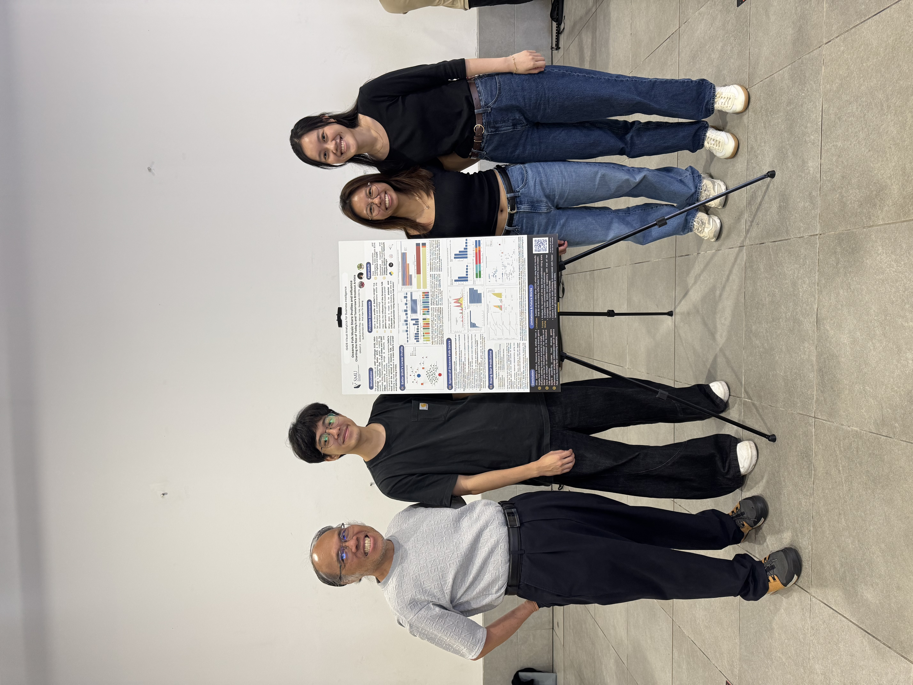

Hello! We are a group of final year SMU Information Systems (Smart-City Management and Technology) students from AY2025/26 Term 2 IS428 Visual Analytics for Business Intelligence G2, taught by Professor Kam Tin Seong.

Group 2 – Team PowerPuffs:

-   Anthea CHUA Xinyi [(LinkedIn)](https://www.linkedin.com/in/anthea-chua-xy/)

-   Marcus TAN [(LinkedIn)](https://www.linkedin.com/in/marcus-tan01)

-   Savannah KOH Ye [(LinkedIn)](https://www.linkedin.com/in/savannah-koh-ye)

This is our website for our Visual Analytics project.

{fig-align="center"}

**GitHub Repository:**

<https://github.com/ac080/IS428_powerpuffs>
