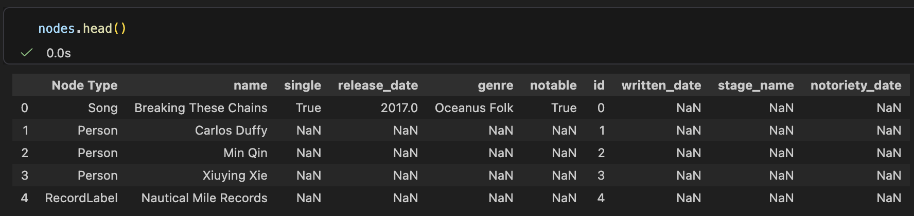
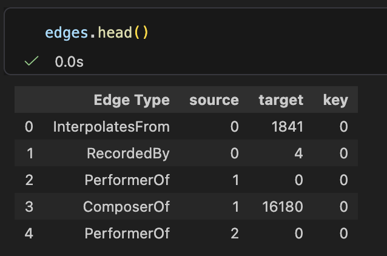
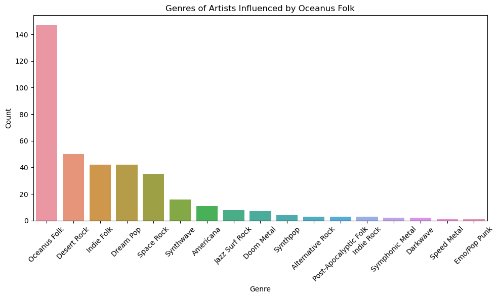
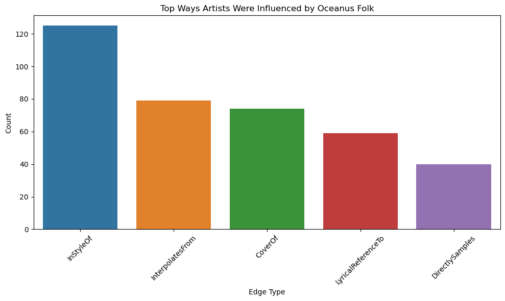
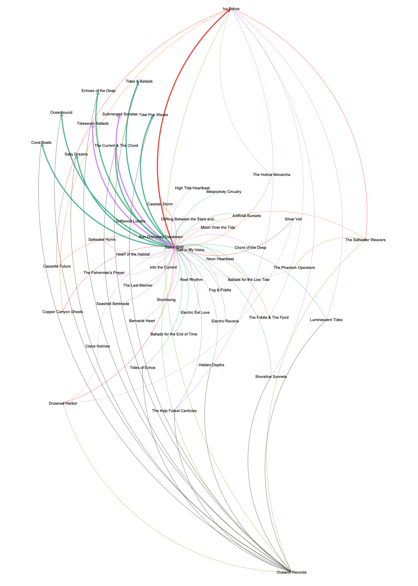
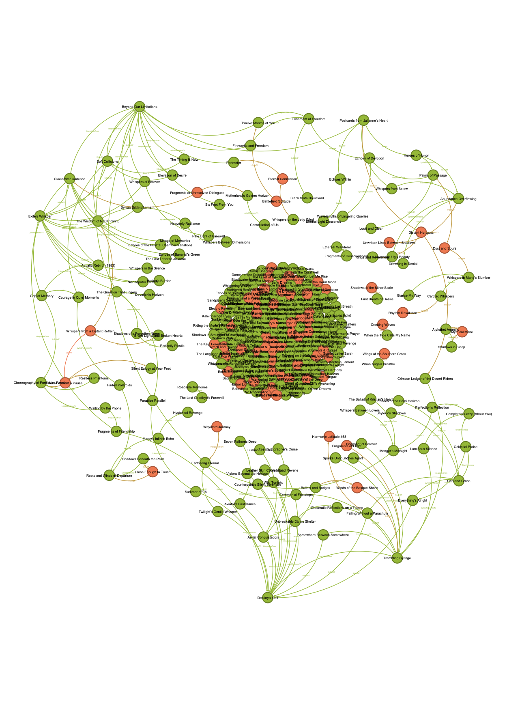
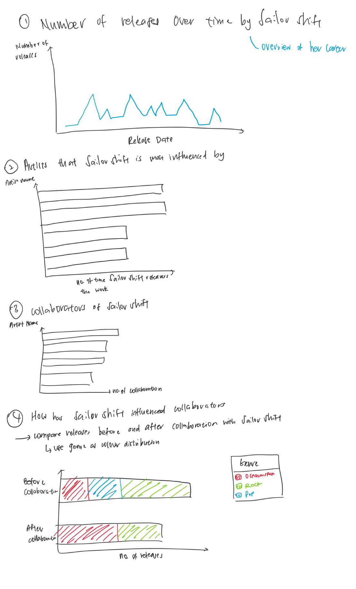
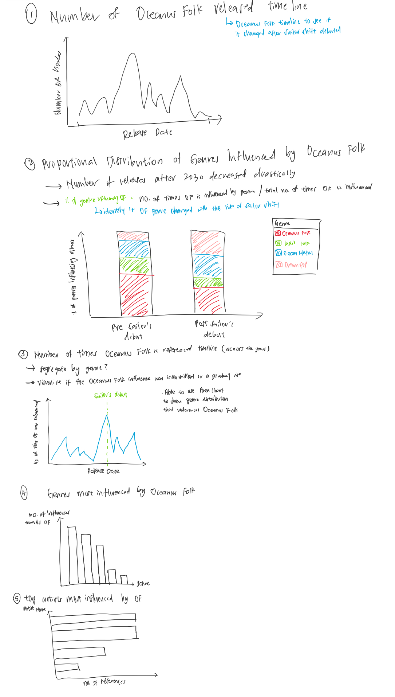
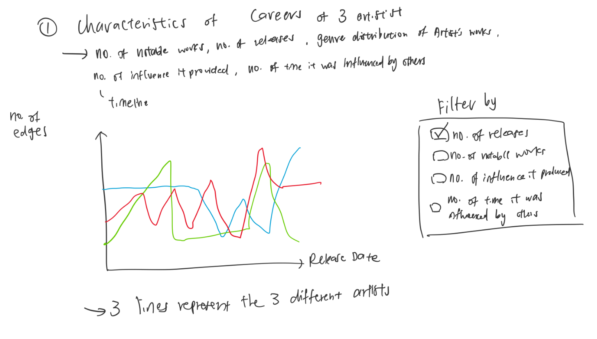

## Data Exploration

Before our team started on creating the visualisation, we performed extensive Exploratory Data Analysis (EDA) to get a better understanding of the underlying distributions and relationships within the dataset. Our team decided to utilise a shared Jupyter Notebook and Gephi for initial network mapping. The complete code and transformation logic are documented in our GitHub repository under the ‘Data Transformation Notebook’. A primary objective of this phase was to ensure that all Tableau visualizations remained statistically aligned with the raw source data.

Our team began by auditing the structure of the Nodes.csv and Edges.csv files to map out the relational hierarchy of the dataset.

On top of this, we generated preliminary graphs to allow us to have a sense of how the dataset looks. Additional detailed statistical analysis, including frequency distributions and outlier detection, is documented in the 'basic_eda.ipynb' notebook.

For Theme 3 specifically, we performed specialised EDA and data preparation to define and calculate the 'Rising Star' metrics. This involved iterative data preparation across multiple notebooks, including 'theme3_prep_eda.ipynb', 'theme3_final.ipynb', 'three_artists_db4.ipynb' and 'three_artists.ipynb', to ensure the metrics were logically sound.

Initially, we utilised Gephi to generate high-fidelity network graphs of Sailor Shift’s influence and the broader Oceanus Folk ecosystem. While these graphs provided a broad overview of the musical industry, we felt that they were hard to analyse as a whole and should be used instead as an introduction into the topic.

### Sailor Shift's Network Graph

{fig-align="center" width="620"}

### Oceanus Folk Network Graph

{fig-align="center" width="574"}

## Visualisation Prototypes

Following the EDA phase, our team engaged in a collaborative whiteboarding session. By sketching prototypes, we were able to map specific chart types to our core research questions, ensuring that every visualisation served a direct purpose in the final narrative.

### Theme 1 Visualisation Prototype

### Theme 2 Visualisation Prototype

### Theme 3 Visualisation Prototype

