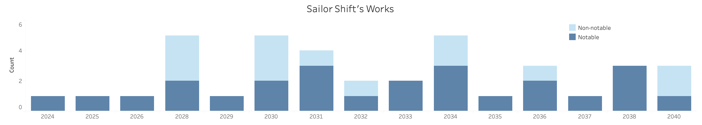
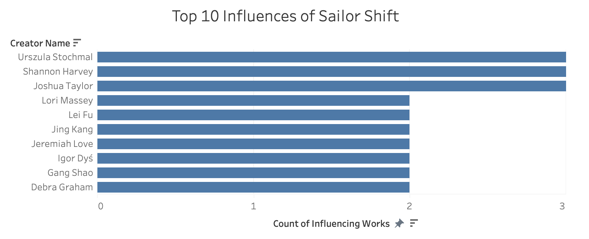
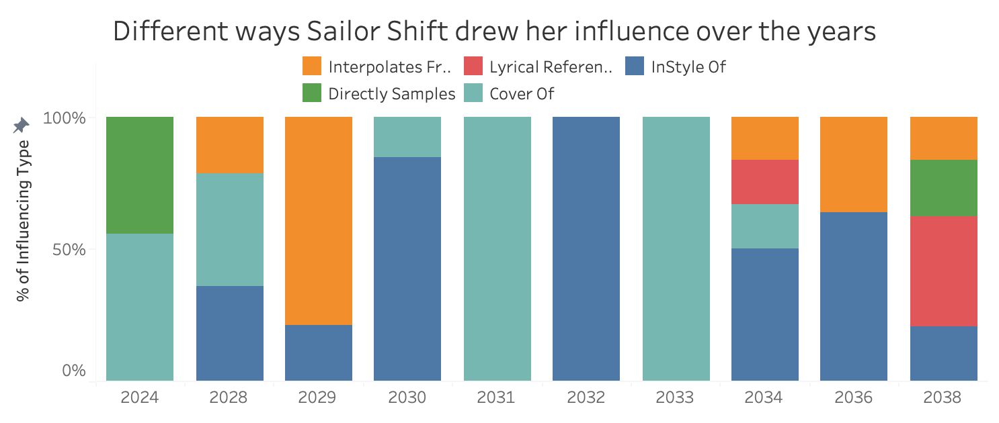
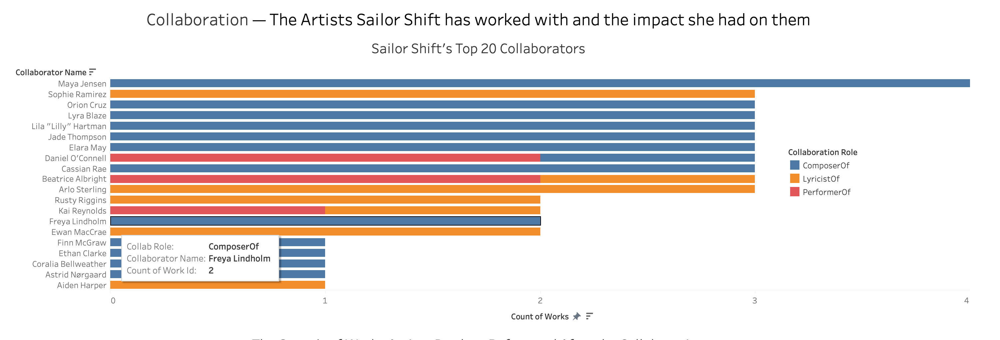
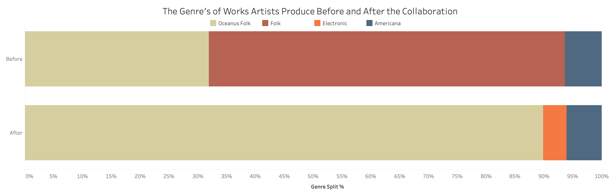
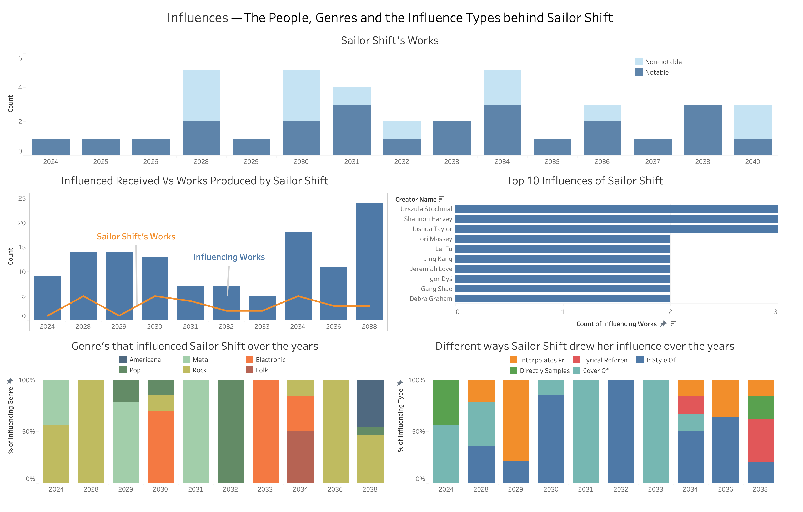
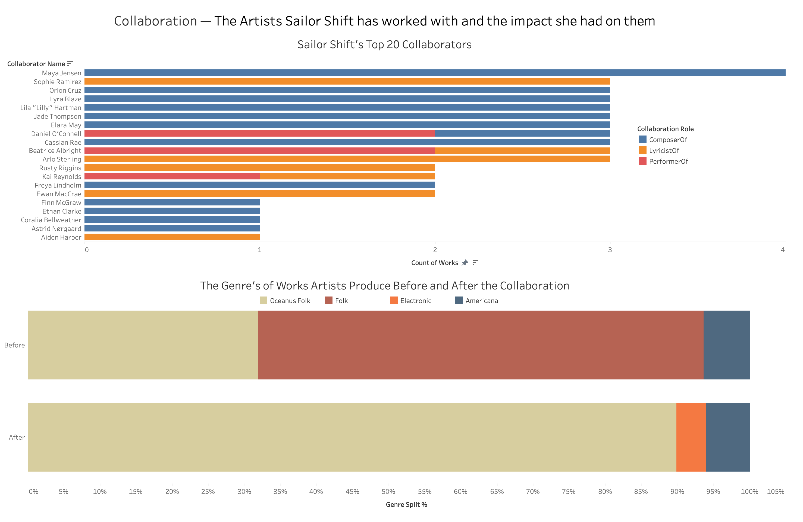

## Theme 1 Overview

Sailor Shift did not become a global superstar overnight. Her career is a layered story of artistic formation, shaped by the music she drew from, the people she created with, and the identity she built over time. Behind each successful work sits a network of reference points and creative relationships that helped define both her sound and her rise.

This theme traces that story in three directions. First, it looks inward to understand who and what shaped Sailor's artistic voice. Second, it maps the artists she worked with and the roles those collaborators played. Third, it examines whether collaboration with Sailor changed the music those artists went on to make, especially in relation to Oceanus Folk.

This theme aims to answer 3 main questions:

-   Who has Sailor Shift been most influenced by over time, and how has the nature of that influence changed?

-   Who has she collaborated with, and what roles did she take on in those partnerships?

-   How has she influenced the collaborators she worked with, and what does that suggest about the spread of Oceanus Folk?

### Key definitions used throughout

-   **Influence** refers to works that Sailor Shift's songs draw from through influence-type edges: `InStyleOf`, `CoverOf`, `DirectlySamples`, `InterpolatesFrom`, and `LyricalReferenceTo`. In graph terms, Sailor's work is the source and the referenced work is the target.

-   **Collaboration role** refers to the formal credited relationship between Sailor and a co-contributor: `ComposerOf` (contributed to the musical composition), `LyricistOf` (contributed to the lyrics), or `PerformerOf` (appeared as a performing artist).

-   **Sailor Shift's breakthrough** refers to 2028, the year her debut solo single went viral and reached the top of the global charts. This year is the main temporal dividing line used throughout this theme.

-   **Notable work** refers to a song or single identified in the dataset as notable based on chart performance, sales, and streams.

-   **Genre shift** describes the change in the genre distribution of a collaborating artist's output before versus after the period of working with Sailor Shift.

-   **Top 20 collaborators** are ranked by total credited works shared with Sailor Shift across all collaboration roles.

## Part 1: Career Identity。 What Kind of Artist is Sailor Shift?

.png)

### Sailor Shift's Career Overview

The network graph maps Sailor Shift's full career structure as captured in the knowledge graph. Her central node carries a weight of 52, representing the total number of relationship edges connecting her to other nodes. Six edge types fan outward: `PerformerOf` (26), `LyricistOf` (21), `InStyleOf` (2), `DirectlySamples` (1), `LyricalReferenceTo` (1), and `MemberOf` (1).

`PerformerOf` and `LyricistOf` together account for over 90% of her edges, showing that Sailor built her career as both a front-facing performer and a writer with strong authorial control. Her 21 `LyricistOf` credits suggest she was not simply lending her voice to works, but actively shaping their language and message.

The 42 green work nodes span titles from *Oceanbound* and *Salty Dreams* to *Ballads for the End of Time* and *Between the Stars and the Sea*. Despite the breadth of influences explored later in this theme, the red genre nodes tell a strikingly consistent story: **Oceanus Folk (45)** dominates overwhelmingly, while **Electronic** and **Americana** appear only once each. Sailor's catalogue is therefore not a story of constant genre switching. Instead, it is the story of an artist who absorbs outside influence while maintaining a stable Oceanus Folk identity. The single `MemberOf` edge linking her to Ivy Echoes provides the origin point, showing that her band years from 2023 to 2026 were the foundation from which her solo career grew.

## Part 2: Who has Sailor Shift been most influenced by?

### Works Output Over Time

Sailor Shift's annual output from 2024 through 2040 is broken into notable (dark blue) and non-notable (light blue) works. Output peaks in 2028, 2030, and 2034, each aligning with major moments in her career. The concentration of notable works in these years suggests that these were not only productive periods, but also the moments when her work had the strongest public impact.

### Top 10 Influences

Sailor's influences are broad rather than dominated by a single creator. Urszula Stochmal, Shannon Harvey, and Joshua Taylor each appear as the source of 3 influencing works, while the remaining seven creators each contribute 2 works.

This relatively even spread across the top 10 suggests that Sailor's artistic development was pluralistic rather than derivative. Her sound is built from a range of creators rather than a single dominant mentor or lineage, and those sources extend well beyond the Oceanus Folk tradition.

### How She Drew Influence Over the Years

The type of influence Sailor draws from also changes over time. In her early years, influence is spread across `InStyleOf`, `InterpolatesFrom`, and `LyricalReferenceTo`. From 2028 to 2031, `InStyleOf` becomes dominant, showing that her main mode of borrowing shifts toward broad stylistic adoption rather than direct sonic reuse.

By 2038, `InterpolatesFrom` and `LyricalReferenceTo` re-emerge alongside `InStyleOf`, suggesting a later-career phase in which Sailor becomes more explicit about her references. Rather than only absorbing influence into style, she appears increasingly willing to foreground and acknowledge it.

## Part 3: Who has Sailor Shift collaborated with， and how did that shape her?

### Top 20 Collaborators

Sailor Shift works with a broad network of collaborators, but a smaller recurring core appears multiple times across her catalogue. Maya Jensen, her former Ivy Echoes bandmate, leads all collaborators with 4 shared works, all coded as `ComposerOf`, which suggests that their post-band relationship continued primarily through compositional partnership rather than shared performance.

Sophie Ramirez, Orion Cruz, Lyra Blaze, Lila "Lilly" Hartman, Jade Thompson, and Elara May each contribute to 3 works, forming a trusted inner circle around Sailor's creative process. Daniel O'Connell appears with both `PerformerOf` and `ComposerOf` roles, indicating that he entered her orbit as both a performer and a creative contributor. Beatrice Albright and Arlo Sterling show a strong `LyricistOf` component, suggesting lyric-driven working relationships. Artists such as Aiden Harper and Astrid Nørgaard appear only in `LyricistOf`, implying that Sailor occasionally brought in outside writing voices for specific creative moments rather than relying entirely on self-writing.

### Genre Shift Before and After Collaboration

The clearest downstream effect of collaboration is genre shift. Before working with Sailor, her collaborators' output is more mixed: Folk makes up roughly 55%, Oceanus Folk about 32%, and Americana a small remainder. In other words, Sailor was not collaborating only with artists already fully embedded in Oceanus Folk.

After collaboration, Oceanus Folk expands to dominate approximately 90% of collaborators' output. Folk drops to near-negligible levels, while Electronic appears for the first time and Americana maintains a small presence. This does not prove that Sailor alone transformed the wider music community, but it does show a strong and consistent shift among the artists closest to her. The most defensible conclusion is that Sailor played a major role in pulling collaborators from adjacent genres into the Oceanus Folk orbit.

## Final Dashboards

### Dashboard 1: Sailor Shift's Influences

Dashboard 1 shows that Sailor's artistic development was shaped by a wide spread of creators rather than a single dominant influence. Her most impactful years also coincide with peaks in output, while the influence-type breakdown shows a shift from mixed borrowing toward stronger stylistic adoption during her breakthrough period. Taken together, these visuals suggest that Sailor's sound matured through a broad and evolving set of influences rather than through imitation of one specific artist or tradition.

### Dashboard 2: Sailor Shift's Collaborations and Their Impact

Dashboard 2 shows both the structure of Sailor's collaborator network and the effect of working with her. A recurring inner circle appears across multiple works and roles, indicating stable creative partnerships rather than isolated features. More importantly, the collaborators' post-collaboration output shifts heavily toward Oceanus Folk. This suggests that Sailor did not simply participate in the genre. She helped reinforce and extend it through the artists she worked with most closely.