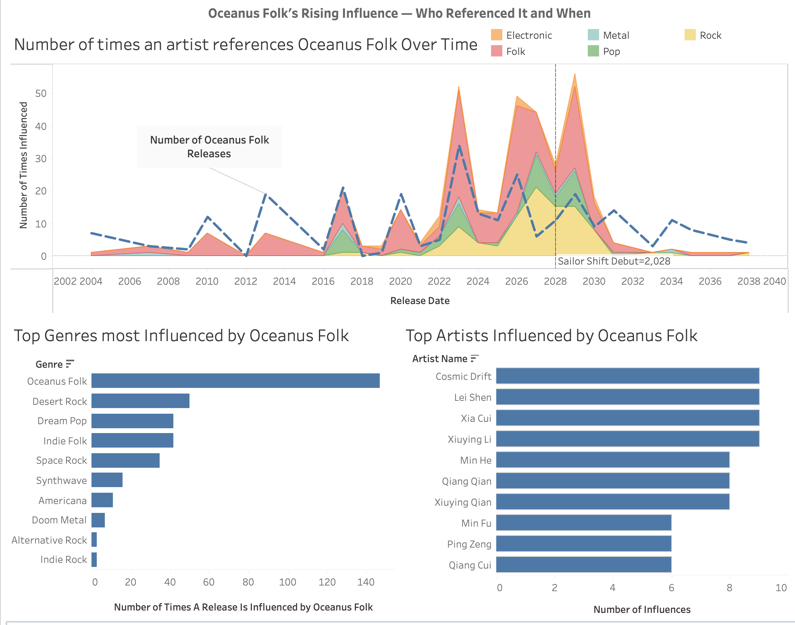
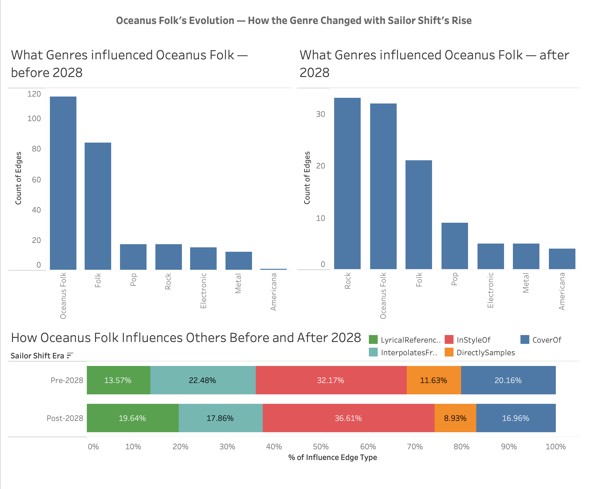

## Theme 2 Overview

Oceanus Folk is a genre that existed largely in isolation, where it is loved locally but unknown globally. Today, it is sampled and influenced by Rock and Pop artists, and cited as an inspiration by musicians across more than ten genres worldwide. This transformation did not happen gradually or organically. It happened because of one artist.

Sailor Shift's rise from Oceanus native to global superstar created a ripple effect that extended far beyond her own music. Her debut allowed artists who had never heard of Oceanus Folk began referencing it, sampling it, and writing in its style. At the same time, Oceanus Folk itself began to evolve. It started absorbing influences from the very genres it was now inspiring, shifting its sound from a pure folk tradition into something more commercially hybrid.

This theme aims to answer 3 main questions:

-   Was Oceanus Folk's growing influence a sudden event or a slow build?

-   Which genres and artists were influenced most by Oceanus Folk's

-   How did Oceanus Folk itself change in response to its own success?

### Key definitions used throughout

-   **Influence** is measured by outbound influence: the count of influence-type edges (InStyleOf, CoverOf, DirectlySamples, InterpolatesFrom, LyricalReferenceTo) where the artist's own works are the source — meaning their songs cite, cover, or draw from other works. This measures how actively an artist engages with and builds upon the broader musical landscape. Inbound influence (being cited by others) was considered but ultimately excluded from scoring due to a systematic data lag: recent artists, including Sailor Shift herself, score near zero because newer works have not yet accumulated citations in the crowdsourced dataset.
-   **Artist role** is where an artist may be credited as a PerformerOf, ComposerOf, LyricistOf, or ProducerOf a given track. An artist who both performed and produced the same song that references Oceanus Folk receives credit for both contributions.
-   **Sailor Shift Era** is used to divide the data into Pre-2028 (before Sailor's solo debut) and Post-2028 (after). The year 2028 is used as the dividing line because it marks the year Sailor Shift released her first solo single after Ivy Echoes disbanded.
-   **Genre group** is a broader classification used for colour coding throughout the dashboards. Individual genres (Desert Rock, Dream Pop, Indie Folk, Synthwave etc.) are grouped into five families: Folk, Rock, Pop, Electronic, and Metal. The Americana genre remains as a standalone genre. This grouping makes the colour coding readable across charts while preserving the ability to drill into specific genres via filters.
-   **Source released after Target** indicates that the source song’s release year is the same as or later than that of the referenced target song.
-   **Percentage of Genres Influencing Oceanus Folk** metric represents the proportional share of each genre's influence relative to the total volume of influences received by Oceanus Folk within a given period.

## Part 1: Was Oceanus Folk's influence growth intermittent or a gradual rise?

.png)

### Number of times an artist referenced Oceanus Folk

This shows how Oceanus Folk's influence had intermittent peaks from the past that evolved into substantial, sustained increase in adaptation. Only songs that released in the same year or later than that of the referenced target song is included.

From 2004 to 2021, references to Oceanus Folk from other genres were sparse and inconsistent. The genre was occasionally acknowledged by adjacent Folk artists, but did not make meaningful impression on other genres. The first notable shift began in 2023, when Ivy Echoes debuted, the Folk genre references started increasing more consistently.

Despite a decline in the number of Oceanus Folk releases, the number of references continued to increase intermittently across other genres like Rock and Pop. The peak in the influence of Oceanus Folk can be seen right after Sailor's debut in 2028, showing her breakthrough had caused a temporary trend in Oceanus Folk.

### First Time Each Genre was Influenced by Oceanus Folk

This visualisation shows the milestones of how Oceanus Folk's influence spread genre by genre. The graph shows that the genre's growth was not a linear progression but rather a series of intermittent surges, characterised by the following phases.

-   **Niche Foundation (2004-2012):** Oceanus Folk itself began referencing its own traditions as early as 2004, with Doom Metal following in 2007 and Indie Folk in 2010. During the first decade, the spread was slow and hesitant, shown by significant multi-year silences (3 years between adoptions). This indicates an insular ecosystem where the genre remained confined to specialized folk and metal niches.

-   **Breakout Wave (2017-2020):** After a 5 year period of low activity, the genre reached a tipping point. Between 2017 and 2020, a sudden surge of genres like Alternative Rock, Dream Pop, Synthpop, Space Rock, Darkwave and Desert Rock adopted Oceanus Folk. This was not a gradual increase but a sudden burt of interest suggesting that the genre had reached a new level of cultural visibility.

-   **Standardised Genre (2021-2034):** Post 2020, the growth became more gradual where a new genre is influenced by Oceanus Folk every one to two years, showing that the genre has moved from being a trend to an established industry standard.

The overall pattern indicated that Oceanus Folk's influence spread had intermittent surges rather than a gradual rise. The 2017 cluster served as a catalytic inflection point, where the genre transitioned from a niche genre to a widely adopted genre.

## Part 2: Which genres and artists were influenced most by Oceanus Folk?

### Top Genres Most Influenced by Oceanus Folk

This shows that Oceanus Folk itself leads by a huge margin of 147 references. This reflects an insular ecosystem, where the community actively builds on its own genre. Outside the genre itself, Desert Rock (50), Dream Pop (43) and Indie Folk (42) emerge as primary adopters. The high volume in these genres suggests a strongcompatibility, where the characteristics of Rock and Pop sub-genres align with the Oceanus Folk.

### Heatmap of Top Genres Influenced by Oceanus Folk

The heatmap reveals a significant temporal shift in how the influence was distributed. While internal self-influence peaked in 2023 (Ivy Echoes' debut year), external adoptions by Space Rock, Dream Pop and Desert Rock had a peak in references in 2028 onward, coinciding with Sailor Shift's debut.

The heatmap shows that these influences were time bounded rather than sustained. For almost every genre shown, the influences are highly concentrated in three peak years (2023, 2028, 2029) rather than being distributed evenly across the timeline. This reinforces the findings that Oceanus Folk generates intense intermittent surges during key milestones rather than a gradual increase in influence.

This confirms that Sailor Shift's debut acted as a catalytic event, triggering a massive adoption by mainstream Rock and Pop genre.

### Top Artists Influenced by Oceanus Folk

The bar chart shows artists who are strongly influenced by Oceanus Folk. The top four artists (Cosmic Drift, Lei Shen, Xia Cui and Xiuying Li) each shows a frequency of 9 references. Unlike a mainstream artist who might borrow a sound for a few songs, these artists demonstrate deep, repeated engagement. This confirms they are the core practitioners who define the genre's ongoing relevance.

.png)

### Top 10 Artist Most Influenced by Oceanus Folk and their Career

This network graph shows the analysis from individual artists to the genres they release, revealing which artists engaged most deeply with Oceanus Folk, how they engage with it through the Edge Type distribution, and which genre was they released that were influenced by Oceanus Folk.

Ten artists most influenced by Oceanus Folk are shown as blue nodes, connected through five orange edge type nodes - InStyleOf (18), LyricalReferenceTo (13), InterpolatesFrom (14), DirectlySamples (7), and CoverOf (9) — which then connect to five red genre nodes representing the genres those artists released - Indie Folk (28), Oceanus Folk (12), Space Rock (12), Dream Pop (5), and Desert Rock (4).

The most common way these top artists engaged with Oceanus Folk is through artistic inspiration (InStyleOf) rather than direct sampling or covering. This suggests Oceanus Folk's influence on these artists operated primarily at the level of aesthetic and approach rather than explicit musical borrowing.

Despite the genre's broader mainstream genre, the genres released by the top artists remains dominated by Indie Folk, which confirms the finding from the heatmap, that Oceanus Folk is an insular ecosystem that influences itself.

The network shows that the top 10 most influenced artists are not just casual observers, they are deep practitioners anchored in the Indie Folk community.

## Part 3: How did Oceanus Folk itself change with the rise of Sailor Shift?

### Genre Distribution That Influenced Oceanus Folk Before and After Sailor's Debut

This shows explicitly how Oceanus Folk's musical identity shifted in response to Sailor's debut. The chart uses the percentage of genres influencing Oceanus Folk due to the drastic decrease in the number of songs released after 2030.

Before 2028, Oceanus Folk's was predominantly inspired by two genres, Oceanus Folk (44%) itself and Folk (32%) genre, accounting for about 75% of all influences that Oceanus Folk song drew from prior to Sailor's debut. Other genres such as Rock, Pop, Metal and Electronic each contributed about 5% or less, showing that Oceanus Folk was a genre almost entirely referencing itself and its broader Folk genre.

Post 2028 shows a drastic change in the genres influencing Oceanus Folk. While Oceanus Folk remains the largest proportion at 29%, its dominance decreased significantly. The emergence of Rock which became the second largest influencer of Oceanus Folk at 30%, despite being a genre that was barely influencing Oceanus Folk pre-2028. Folk still maintained its presence at 19%, but has a substantially smaller share than Rock. This shows that Oceanus Folk artists consciously incorporates Rock into their work as the genre gained mainstream exposure.

In totality, Oceanus Folk still retained its Folk core but evolved significantly by referencing Rock and Pop. This musical evolution in Oceanus Folk mirrors the findings in Theme 1, where Sailor's own artistic trajectory moved from pure Oceanus Folk to referencing more Rock music.

### How Oceanus Folk Influences Others Before and After Sailor's Debut

This distributionshows the nature of how other genre is influenced by Oceanus Folk.

Pre-2028 shows that DirectlySamples and InterpolatesFrom held a larger proportion of the chart. This suggests that early engagement with Oceanus Folk was largely functional. Other artists used the genre as a toolbox, extracting specific melodies or sound bites to incorporate into their own tracks. Influence was based on the physical components of the music.

Post-2028 shows a significant increase in the proportion of InStyleOf and LyricalReferenceTo influence. This growth indicates that Oceanus Folk has transitioned into a stylistic standard. Artists are no longer just borrowing parts of the songs, they are adopting the entire artistic nature, structural philosophy, and lyrical themes of the genre.

CoverOf remains relatively constaint, showing that covers remain a staple of folk tradition, they have been overshadowed by original works created InStyleOf the genre. This proves that Oceanus Folk has moved past being a library of songs to be replayed, and has become a living aesthetic that inspires new creation.

This further proves that Sailor's debut changed the quality and type of influence of Oceanus Folk. The genre evolved from a source of technical material (sampling/interpolation) into a prestigious aesthetic identity, as evidenced by the post-2028 surge in InStyleOf and LyricalReferenceTo interactions.

## Final Dashboards

### Dashboard 1: Oceanus Folk's Rising Influence

The dashboard shows that Oceanus Folk's influence shows three intermittent spikes. Following a decade of niche activity, the genre grew rapidly and experienced a sharp spike in the mid 2020s. This growth was directly driven by Sailor's rising profile, characterising the genre's expression as a concentrated breakout rather than a steady growth.

At a genre level, it is revealed that while Oceanus Folk's reach expanded, its highest intensity of influence remained concentrated within its own internal canon rather than spreading evenly across the musical landscape. This suggests a bottleneck of deep influence. Despite the genre adopting Rock and Pop elements, it primarily functioned as a self-referential ecosystem where the most significant direct influence relationships stayed within the Folk community.

Moreover, at an individual artist level, Oceanus Folk's adopters form a community of similarly committed artists rather than being dominated by one or two outliers.

### Dashboard 2: Oceanus Folk's Evolution

This dashboard shows how Oceanus Folk's musical inspiration shifted before and after Sailor's debut, and whether the nature of that shift was superficial or fundamental.

The before and after comparison of genre influences on Oceanus Folk reveals a significant change transformation. Pre-2028, Oceanus Folk was heavily influencing itself, where Oceanus Folk itself was the dominant influence source, with Folk second. Whereas post-2028 shows a significant increase of Rock, overtaking Oceanus Folk itself. This shows a fundamental restructuring of Oceanus Folk's creative reference points.

Oceanus Folk is no longer a genre that references its own Folk community for inspiration, it is now a genre that actively engages with Rock. This reflects Oceanus Folk artists responding to and absorbing Rock influences that Sailor herself incorporated into her solo work.

While Oceanus Folk changed what it drew inspiration from, the way other artists engaged with Oceanus Folk itself remained largely consistent. The most common way artists engaged with Oceanus Folk before and after Sailor's debut was through stylistic inspiration (InStyleOf). This suggests that while the musical makeup of Oceanus Folk evolved, its influence to other works as a stylistic vibe remained its consistent.
