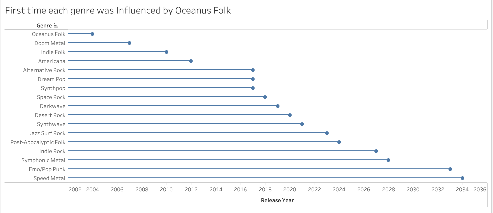
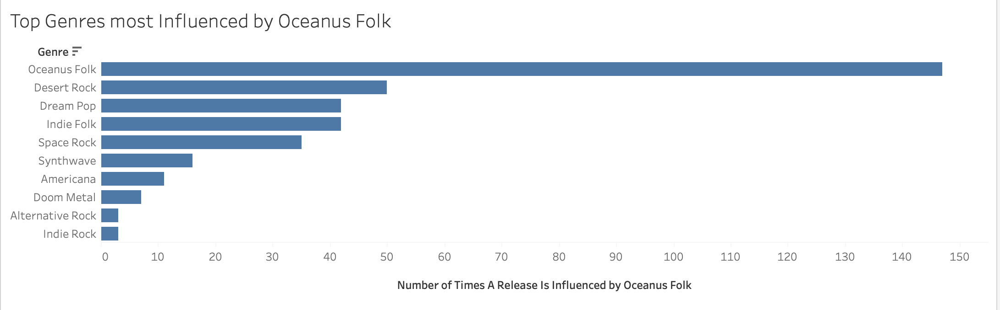
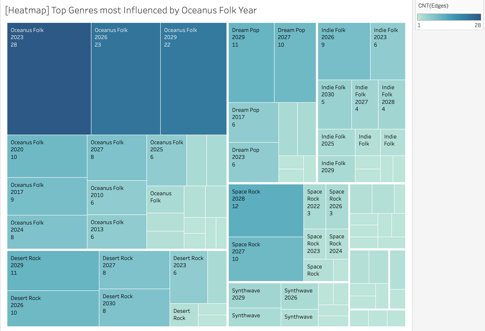
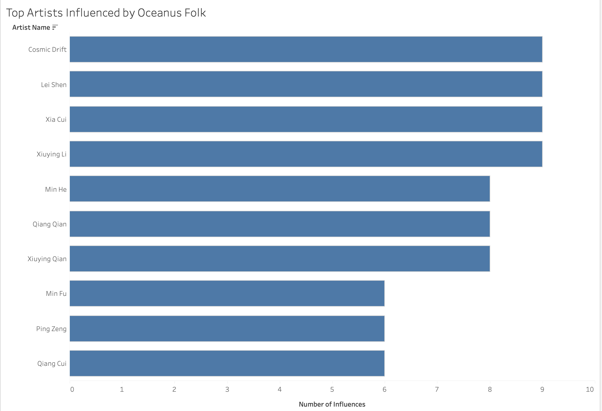
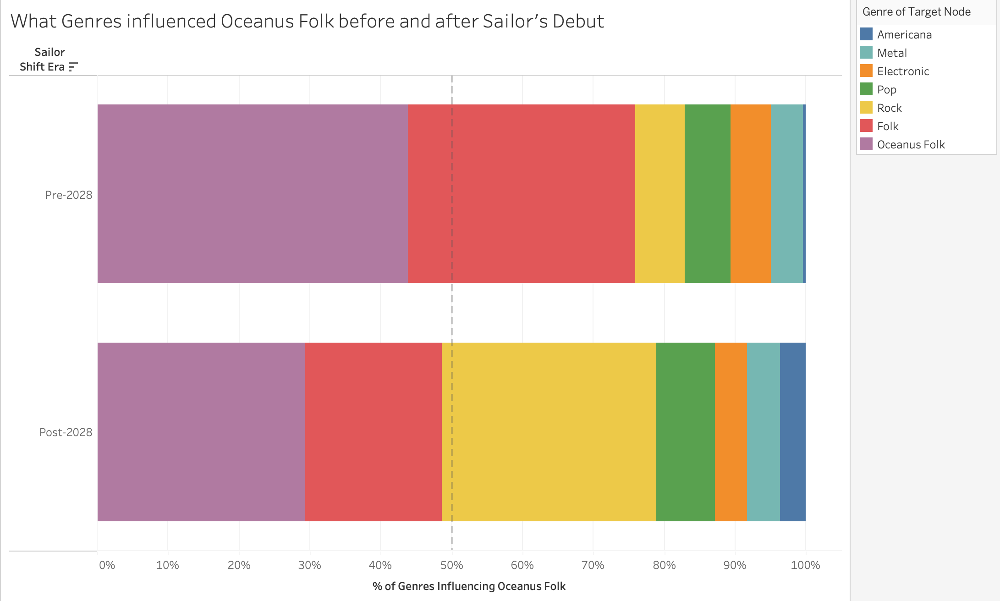
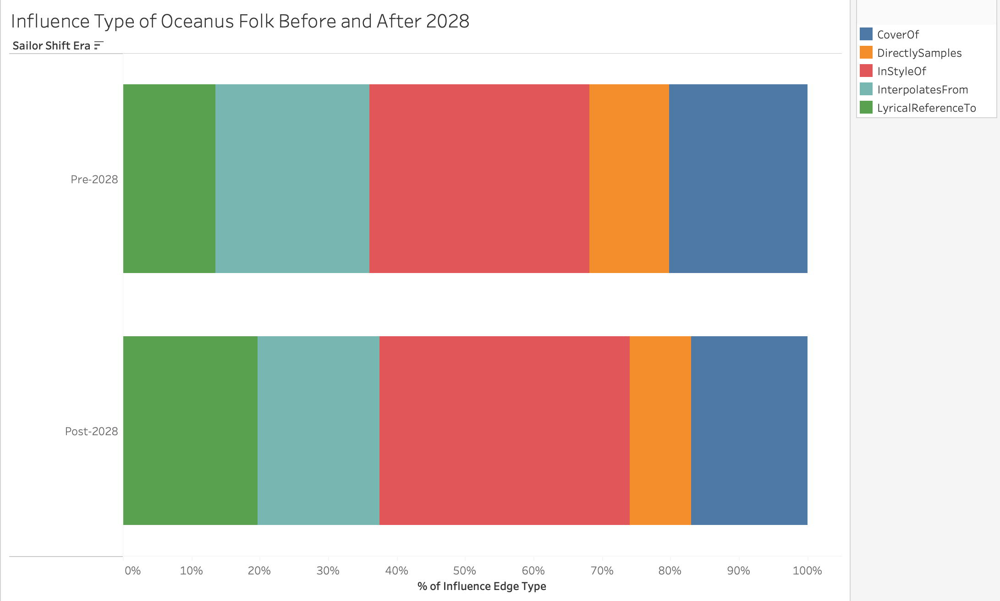

## Theme 2 Overview

Oceanus Folk is a genre that existed largely in isolation, where it is loved locally but unknown globally. Today, it is sampled and influenced by Rock and Pop artists, and cited as an inspiration by musicians across more than ten genres worldwide. This transformation did not happen gradually or organically. It happened because of one artist.

Sailor Shift's rise from Oceanus native to global superstar created a ripple effect that extended far beyond her own music. Her debut allowed artists who had never heard of Oceanus Folk began referencing it, sampling it, and writing in its style. At the same time, Oceanus Folk itself began to evolve. It started absorbing influences from the very genres it was now inspiring, shifting its sound from a pure folk tradition into something more commercially hybrid.

This theme aims to answer 3 main questions:

-   Was Oceanus Folk's growing influence a sudden event or a slow build?

-   Which genres and artists were influenced most by Oceanus Folk's

-   How did Oceanus Folk itself change in response to its own success?

### Key definitions used throughout

-   **Influence** is measured by outbound influence: the count of influence-type edges (InStyleOf, CoverOf, DirectlySamples, InterpolatesFrom, LyricalReferenceTo) where the artist's own works are the source — meaning their songs cite, cover, or draw from other works. This measures how actively an artist engages with and builds upon the broader musical landscape. Inbound influence (being cited by others) was considered but ultimately excluded from scoring due to a systematic data lag: recent artists, including Sailor Shift herself, score near zero because newer works have not yet accumulated citations in the crowdsourced dataset.
-   **Artist role** is where an artist may be credited as a PerformerOf, ComposerOf, LyricistOf, or ProducerOf a given track. An artist who both performed and produced the same song that references Oceanus Folk receives credit for both contributions.
-   **Sailor Shift Era** is used to divide the data into Pre-2028 (before Sailor's solo debut) and Post-2028 (after). The year 2028 is used as the dividing line because it marks the year Sailor Shift released her first solo single after Ivy Echoes disbanded.
-   **Genre group** is a broader classification used for colour coding throughout the dashboards. Individual genres (Desert Rock, Dream Pop, Indie Folk, Synthwave etc.) are grouped into five families: Folk, Rock, Pop, Electronic, and Metal. The Americana genre remains as a standalone genre. This grouping makes the colour coding readable across charts while preserving the ability to drill into specific genres via filters.

### Part 1: Was Oceanus Folk's influence growth intermittent or a gradual rise?

.png)

### Part 2: Which genres and artists were influenced most by Oceanus Folk?

.png)

### Part 3: How did Oceanus Folk itself change with the rise of Sailor Shift?

